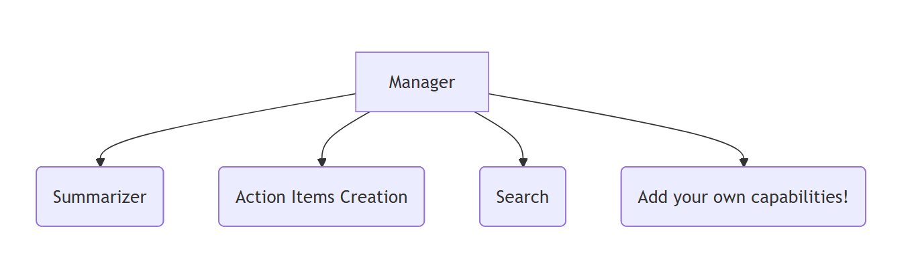
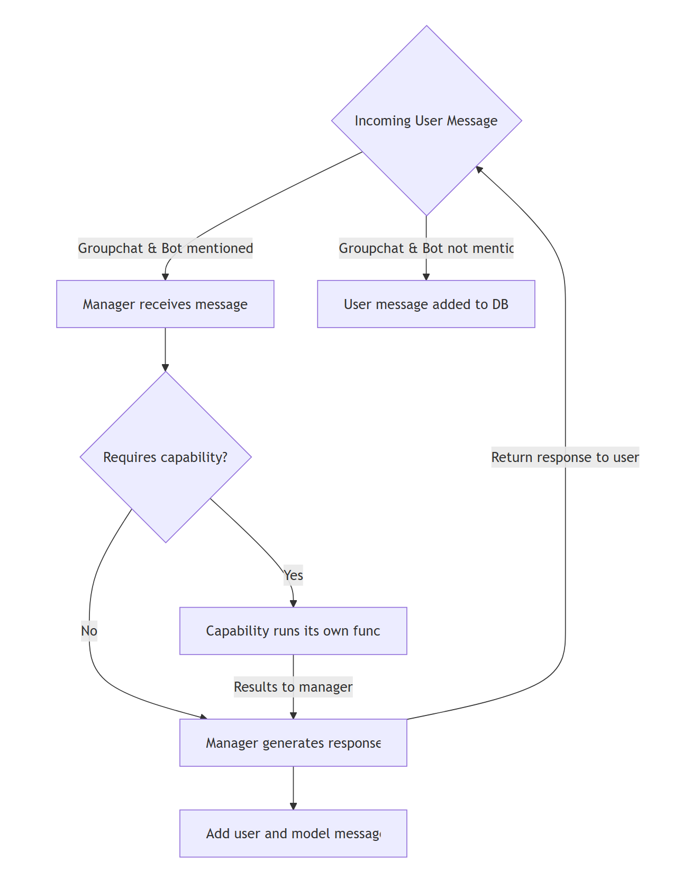

# Missa Agent for Microsoft Teams

This intelligent collaboration assistant is built with the [Microsoft Teams SDK](https://aka.ms/teams-ai-library-v2), and showcases how to create a sophisticated bot that can analyze conversations, manage tasks, and search through chat history using advanced AI capabilities and natural language processing.

This agent can listen to all messages in a group chat (even without being @mentioned) using RSC (Resource Specific Control) permissions defined in [App Manifest](appPackage/manifest.json). For more details, see the documentation [RSC Documentation](https://staticsint.teams.cdn.office.net/evergreen-assets/safelinks/2/atp-safelinks.html).

## Key Features

- 📋 **Intelligent Summarization** - Analyze conversations and provide structured summaries with proper participant attribution and topic identification
- ✅ **Action Items** - Automatically identify and create action items from team discussions with smart assignment
- 🔍 **Conversation Search** - Search through chat history using natural language queries with time-based filtering and deep linking to original messages

## Adding Custom Capabilities

Adding your own capabilities only requires a few steps:

1. Copy the template folder under capabilities [template](src\capabilities\template\template.ts)
2. Customize your capability to do what you want (helpful to look at existing capabilities)
3. Make sure to create a CapabilityDefinition at the bottom of your main file
4. Register your capability by importing the CapabilityDefinition and adding to the definition list in [registry](src\capabilities\registry.ts)
5. The manager will automatically be instantiated with the capability you defined!

## Agent Architecture



## Flow of the Agent



If Missa is added to a groupchat or private message, it will always listen and log each message to its database. The messages are stored in an SQLite DB by the conversation ID of the given conversation. 
The agent will respond whenever @mentioned in groupchats and will always respond in 1-on-1 messages. When the agent responds, the request is first passed through a manger prompt.
This manager may route to a capability based on the request--this capability returns its result back to the manager where it will be passed back to the user.

## Running the Sample

### Prerequisites

- [Node.js](https://nodejs.org/) version 20, 22
- [npm](https://www.npmjs.com/) (comes with Node.js)
- [Microsoft 365 Agents Toolkit](https://marketplace.visualstudio.com/items?itemName=TeamsDevApp.ms-teams-vscode-extension) for Visual Studio Code
- [Visual Studio Code](https://code.visualstudio.com/)
- A Microsoft Teams account with the ability to upload custom apps
- Azure OpenAI resource with GPT-4 deployment
- Azure Speech Service resource
- Azure SQL Database

### Local Development Setup

Before running the bot, you need to configure your environment variables. The project uses `.env.*.user` files (gitignored) for sensitive configuration.

#### 1. Install Dependencies

```bash
npm install
```

#### 2. Configure Environment Variables

Create or update the following files with your Azure credentials:

**For Local Development** (`env/.env.local.user`):
```bash
# Azure OpenAI
SECRET_AZURE_OPENAI_API_KEY=<Your Azure OpenAI API Key>
AZURE_OPENAI_ENDPOINT=<Your Azure OpenAI Endpoint>
AZURE_OPENAI_DEPLOYMENT_NAME=<Your GPT-4 Deployment Name>

# Azure Speech Service
SECRET_AZURE_SPEECH_KEY=<Your Azure Speech Key>
AZURE_SPEECH_REGION=<Your Azure Speech Region>

# SQL Database
SQL_SERVER=<Your SQL Server FQDN>
SQL_DATABASE=<Your Database Name>
SQL_USERNAME=<Your SQL Username>
SQL_PASSWORD=<Your SQL Password>

# Azure Authentication (from your Entra App Registration)
AZURE_TENANT_ID=<Your Azure Tenant ID>
AZURE_CLIENT_ID=<Your Application/Client ID>
SECRET_AZURE_CLIENT_SECRET=<Your Client Secret>

# Microsoft Graph
GRAPH_BASE_URL=https://graph.microsoft.com

# Bot credentials will be auto-populated during local debugging
BOT_APP_ID=
SECRET_BOT_APP_PASSWORD=
PUBLIC_BASE_URL=
```

**For Playground Development** (`env/.env.playground.user`):
- Copy the same configuration from `.env.local.user`
- BOT_APP_ID and SECRET_BOT_APP_PASSWORD will be auto-populated

**For Azure Deployment** (`env/.env.dev.user`):
- All fields should be populated including BOT_APP_ID and PUBLIC_BASE_URL
- BOT_APP_ID should match your Azure Bot Service registration
- PUBLIC_BASE_URL should be your Azure App Service URL (e.g., `https://bot161976.azurewebsites.net`)

#### 3. Required Azure Resources

You'll need to set up the following Azure resources:

1. **Azure OpenAI Service**:
   - Create an Azure OpenAI resource
   - Deploy a GPT-4 model (e.g., `gpt-4` or `gpt-4-turbo`)
   - Copy the endpoint and API key to your `.env.*.user` files

2. **Azure Speech Service**:
   - Create an Azure Cognitive Services Speech resource
   - Copy the key and region to your `.env.*.user` files

3. **Azure SQL Database**:
   - Create an Azure SQL Database (or use existing)
   - Configure firewall rules to allow your IP
   - Create login credentials and copy to your `.env.*.user` files

4. **Entra ID App Registration**:
   - Register an application in Azure Active Directory
   - Generate a client secret
   - Copy Tenant ID, Client ID, and Client Secret to your `.env.*.user` files
   - Configure API permissions as needed (e.g., Microsoft Graph)

#### 4. Verify Configuration

The bot will validate all required environment variables on startup. If any required configuration is missing, you'll see a clear error message indicating which variables need to be set.

Run this command to test your configuration:
```bash
npm run build
node dist/index.js
```

You should see output like:
```
✓ Loaded azureTenantId from AZURE_TENANT_ID: 588cadf4-...
✓ Loaded azureClientId from AZURE_CLIENT_ID: 7ed650f2-...
✓ Loaded azureClientSecret from SECRET_AZURE_CLIENT_SECRET: Vby8****
✓ All required configuration loaded successfully
```

### Running the Bot

> For local debugging using Microsoft 365 Agents Toolkit CLI, you need to do some extra steps described in [Set up your Microsoft 365 Agents Toolkit CLI for local debugging](https://aka.ms/teamsfx-cli-debugging).

1. First, select the Microsoft 365 Agents Toolkit icon on the left in the VS Code toolbar.
2. Press F5 to start debugging which launches your app in Microsoft 365 Agents Playground using a web browser. Select `Debug in Microsoft 365 Agents Playground`.
3. The browser will pop up to open Microsoft 365 Agents Playground.
4. You will receive a welcome message from the agent, and you can send anything to the agent to get an response.
5. @mention the bot in any conversation to start using its capabilities!

#### Sample Questions

You can ask the Missa agent questions like:

**Summarization:**
- "@Missa summarize yesterday's discussion"
- "@Missa what were the main topics from last week?"
- "@Missa give me an overview of recent messages"

**Action Items:**
- "@Missa find action items from the past 3 days"
- "@Missa create a task to review the proposal by Friday"
- "@Missa what tasks are assigned to me?"

**Search:**
- "@Missa find messages about the project deadline"
- "@Missa search for conversations between Alice and Bob"
- "@Missa locate discussions from this morning about the budget"

## Architecture

The Missa agent uses a sophisticated multi-capability architecture:

- **Manager**: Coordinates between specialized capabilities and handles natural language time parsing
- **Summarizer**: Analyzes conversation content and provides structured summaries
- **Action Items**: Identifies tasks, manages assignments, and tracks completion
- **Search**: Performs semantic search across conversation history with citation support
- **Context Management**: Global message context handling for concurrent request support

## Deployment

The agent can be deployed to Azure App Service for production use. See following documentation for detailed instructions on setting up Azure resources and configuring the production environment.
- Host your app in Azure by [provision cloud resources](https://learn.microsoft.com/microsoftteams/platform/toolkit/provision) and [deploy the code to cloud](https://learn.microsoft.com/microsoftteams/platform/toolkit/deploy)
- Azure SQL Database is used to store data, you can set admin password in `env/.env.dev.user`.

If you are trying to local debug / preview deployed version, then either of the two conditions must be met as a min-bar:
1. The user doing the operation should be an admin in the org.
2. The Entra app ID specified in webAppInfo.Id must be homed in the same tenant.
